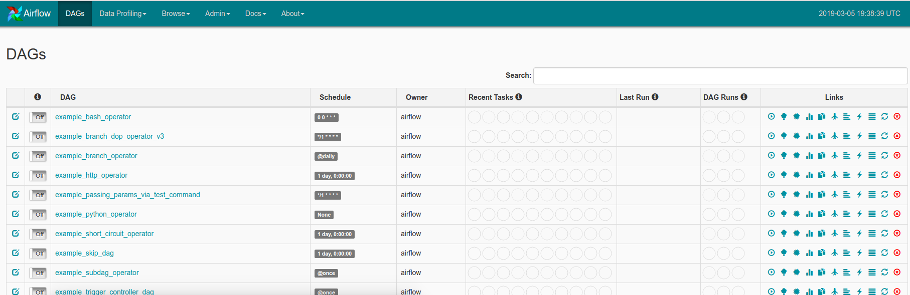

# Airflow Example

Here I am testing Apache Airflow (and doing a basic example) to evaluate
if we could extend it to include Singularity containers and/or HPC.

### Install

```bash
$ SLUGIFY_USES_TEXT_UNIDECODE=yes pip install apache-airflow
```

Create a sqlite database

```
$ airflow initdb
```

The database is created in $AIRFLOW_HOME which looks like it defaults to $HOME/airflow:

```bash
$ ls /home/vanessa/airflow/
airflow.cfg  airflow.db  logs  unittests.cfg
```

The documentation for the tutorial is [here](https://airflow.apache.org/tutorial.html)

### Airflow Client

It looks like the expectation is to put dags (the [pipeline.py](pipeline.py) file
in $HOME/airflow/dags, but it wouldn't be logical (and a good workflow) to have
separate repos all stored there. I'm going to try putting this folder outside
of that root, and for now just test interacting with the airflow client:

```bash
$ airflow list_dags
[2019-03-05 14:14:43,509] {__init__.py:51} INFO - Using executor SequentialExecutor
[2019-03-05 14:14:43,722] {models.py:273} INFO - Filling up the DagBag from /home/vanessa/airflow/dags


-------------------------------------------------------------------
DAGS
-------------------------------------------------------------------
example_bash_operator
example_branch_dop_operator_v3
example_branch_operator
example_http_operator
example_passing_params_via_test_command
example_python_operator
example_short_circuit_operator
example_skip_dag
example_subdag_operator
example_subdag_operator.section-1
example_subdag_operator.section-2
example_trigger_controller_dag
example_trigger_target_dag
example_xcom
latest_only
latest_only_with_trigger
test_utils
tutorial
```

This is a bit confusing because I don't actually see a folder $HOME/airflow/dags.

```bash
$ airflow list_tasks tutorial
[2019-03-05 14:12:34,056] {__init__.py:51} INFO - Using executor SequentialExecutor
[2019-03-05 14:12:34,276] {models.py:273} INFO - Filling up the DagBag from /home/vanessa/airflow/dags
print_date
sleep
templated
```

Tree offers another view of tasks for a dag:

```bash
$ airflow list_tasks tutorial --tree
[2019-03-05 14:12:40,604] {__init__.py:51} INFO - Using executor SequentialExecutor
[2019-03-05 14:12:40,814] {models.py:273} INFO - Filling up the DagBag from /home/vanessa/airflow/dags
<Task(BashOperator): sleep>
    <Task(BashOperator): print_date>
<Task(BashOperator): templated>
    <Task(BashOperator): print_date>
```

### Airflow webserver

Airflow comes with a webserver:

```bash
$ airflow webserver
```



It looks like it requires loading dags from $AIRFLOW_HOME (and not the present working
directory).
### Running the Pipeline

Let's try running the pipeline here - notably it's outside of the folder! I found
the following things:

 - `airflow test` is the way to test a workflow
 - I can provide -sd to change the directory where airflow looks for dags (the python files)
 - The dag_id is defined in the script, and the running command needs that as the first argument
 - The task_id to be run is also defined in the code, in this case if I want the last of the three tasks (templated) it will run the first two because of the dependency structure
 - The last argument is the date.

The command looks like this:

```bash
$ airflow test -sd . pipeline-test templated 2019-03-05
```

Where "pipeline-test" is the dag_id, and found in the script:

```python
dag = DAG('pipeline-test', default_args=default_args, schedule_interval=timedelta(days=1))
```

`templated` is the last task, specifically it's task_id. By selecting this task, we run all tasks in the dag.

```python
t3 = BashOperator(
    task_id='templated',
    bash_command=templated_command,
    params={'my_param': 'Parameter I passed in'},
    dag=dag)
```

This technically means you could also run a subset of the pipeline, like:

```bash
$ airflow test -sd . pipeline-test print_date 2019-03-05
$ airflow test -sd . pipeline-test sleep 2019-03-05
```

Next, let's try:

 - [Running with Docker](docker)
